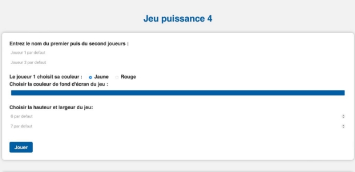
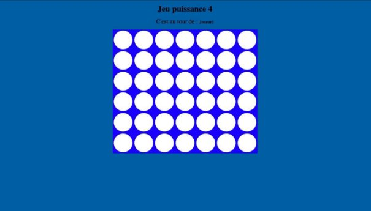

**Puissance 4 en PHP** 

**Ce projet consiste en la création d'un jeu Puissance 4 en PHP.** 

**Comment jouer** 

**Le jeu se joue à deux joueurs, qui alternent pour placer leurs jetons sur un tableau de 6 rangées et 7 colonnes par défaut. Le but est d'aligner 4 jetons de la même couleur (horizontalement, verticalement ou en diagonale) pour remporter la partie.** 

**Pour jouer, suivez ces étapes :** 

1. **Ouvrez un navigateur web et accédez à la page index.php** 
1. **Entrez les noms des deux joueurs et sélectionnez les couleurs de leurs jetons** 
1. **Cliquez sur le bouton "Nouvelle partie" pour commencer le jeu** 
1. **Tour à tour, chaque joueur sélectionne une colonne pour y placer son jeton** 
1. **Si un joueur aligne 4 jetons de sa couleur, il remporte la partie** 

**Fonctionnalités** 

**Le jeu Puissance 4 en PHP offre les fonctionnalités suivantes :** 

1. **Possibilité de personnaliser les noms et les couleurs des joueurs** 
1. **Affichage du tableau de jeu à chaque tour** 
1. **Vérification de l'alignement des jetons et de la fin de la partie** 
1. **Possibilité de personnaliser la couleur de fond de la partie** 

**Installation** 

**Pour installer et exécuter ce jeu, vous aurez besoin d'un serveur Web (comme Apache) et d'un serveur de bases de données (comme MySQL) configurés sur votre machine. Suivez ces étapes :** 

1. **Téléchargez les fichiers du jeu sur votre machine** 
1. **Créez une base de données MySQL pour stocker les informations des joueurs et des parties** 
1. **Placez les fichiers dans le répertoire de votre serveur Web** 
1. **Ouvrez un navigateur Web et accédez à la page index.php** 

**exemple :** 

**ci-dessous :** 

